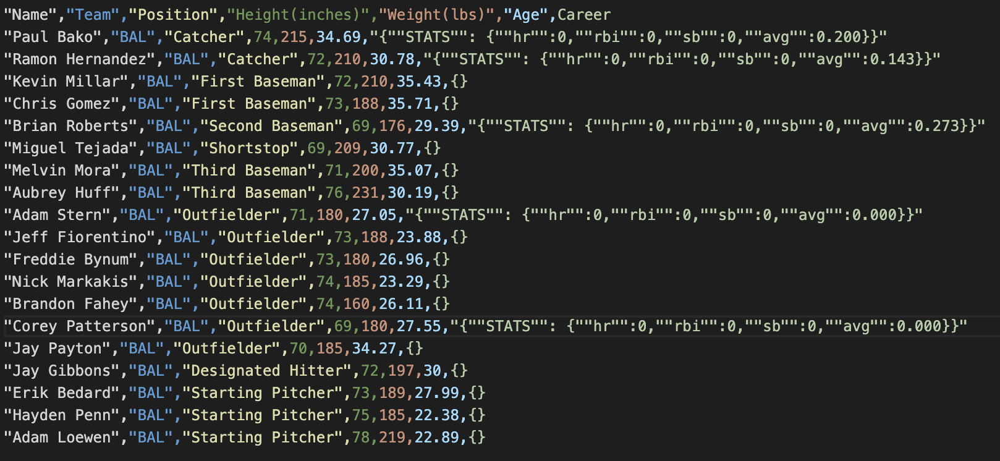
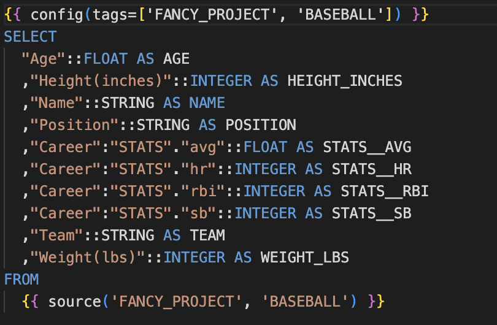

# templater

Templater generates DBT Models from raw CSV files.

These Models have type inference, key normalisation, and generate most of the boilerplate code for you.

It can also spare you the drudgery of "unpacking" variant payloads in your staging SQL models.  

Usage: 

`templater [FIELDS_TO_UNPACK ...]`

FIELDS_TO_UNPACK is an optional indications of which fields are JSON objects, capable of further unpacking.

1. Start with a raw CSV

2. Run templater from the directory containing your collection of CSV files
3. Get a nice DBT model and project config files in return!

